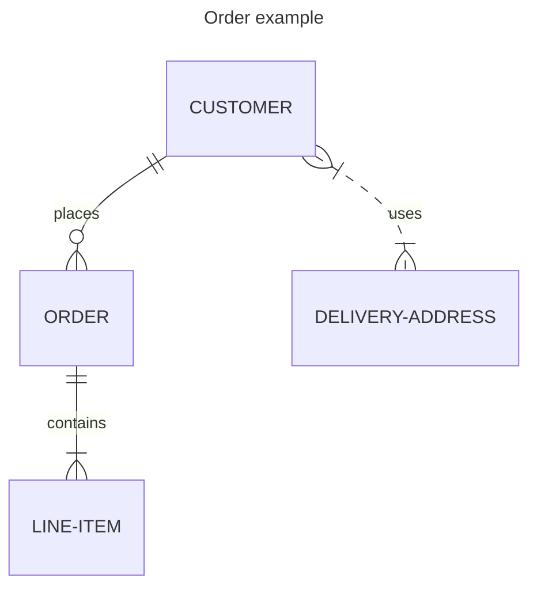

´´´js 
´´´
sasdas
# gitlek2
=======
# gitlek2

This is **bold**

1. First item
2. Second item
3. Third item

---

| Syntax | Description |
| ---------- | ---------- |
| Header | Title |
| Paragraph | Text |

